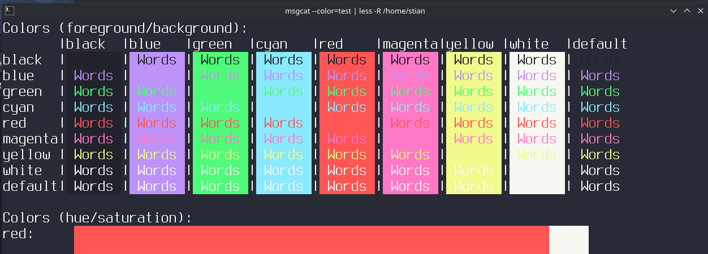

# Dracula for [foot](https://codeberg.org/dnkl/foot)

> A dark theme for [foot](https://codeberg.org/dnkl/foot).

## Install
You can download latest [release](https://github.com/dracula/foot/releases).

Use the ini file and merge the [color] section with your existing file.

If your file is 'clean' or just original.
I'd recommend just to use the patching system described in INSTALL.md.
 
Instructions can be found in the [INSTALL.md](https://github.com.com/foot/blob/master/README.md).

## Team

This theme is maintained by syrofoam.
There is a bunch of [awesome contributors](https://github.com/dracula/template/graphs/contributors).

 |
--- |
Thanks for md/git:
[Zeno Rocha](https://github.com/zenorocha) |

## License

[MIT License](./LICENSE)
